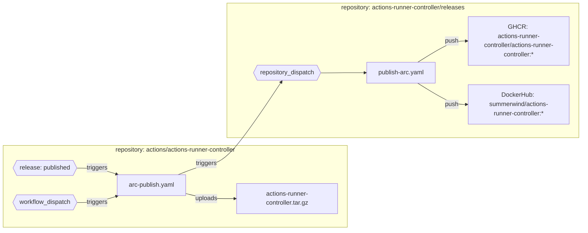
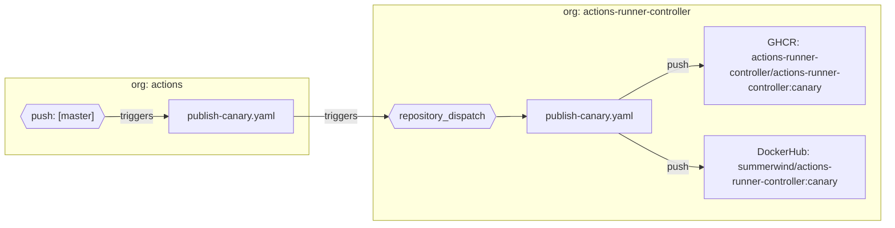

# Contribution Guide

- [Contribution Guide](#contribution-guide)
  - [Welcome](#welcome)
  - [Before contributing code](#before-contributing-code)
  - [How to Contribute a Patch](#how-to-contribute-a-patch)
    - [Developing the Controller](#developing-the-controller)
    - [Developing the Runners](#developing-the-runners)
      - [Tests](#tests)
      - [Running Ginkgo Tests](#running-ginkgo-tests)
    - [Running End to End Tests](#running-end-to-end-tests)
      - [Rerunning a failed test](#rerunning-a-failed-test)
      - [Testing in a non-kind cluster](#testing-in-a-non-kind-cluster)
    - [Code conventions](#code-conventions)
    - [Opening the Pull Request](#opening-the-pull-request)
  - [Helm Version Changes](#helm-version-changes)
  - [Testing Controller Built from a Pull Request](#testing-controller-built-from-a-pull-request)
  - [Release process](#release-process)
    - [Workflow structure](#workflow-structure)
      - [Releasing legacy actions-runner-controller image and helm charts](#releasing-legacy-actions-runner-controller-image-and-helm-charts)
      - [Release actions-runner-controller runner images](#release-actions-runner-controller-runner-images)
      - [Release gha-runner-scale-set-controller image and helm charts](#release-gha-runner-scale-set-controller-image-and-helm-charts)
      - [Release actions/runner image](#release-actionsrunner-image)
      - [Canary releases](#canary-releases)

## Welcome

This document is the single source of truth for how to contribute to the code base.
Feel free to browse the [open issues](https://github.com/actions/actions-runner-controller/issues) or file a new one, all feedback is welcome!
By reading this guide, we hope to give you all of the information you need to be able to pick up issues, contribute new features, and get your work
reviewed and merged.

## Before contributing code

We welcome code patches, but to make sure things are well coordinated you should discuss any significant change before starting the work. The maintainers ask that you signal your intention to contribute to the project using the issue tracker. If there is an existing issue that you want to work on, please let us know so we can get it assigned to you. If you noticed a bug or want to add a new feature, there are issue templates you can fill out.

When filing a feature request, the maintainers will review the change and give you a decision on whether we are willing to accept the feature into the project.

For significantly large and/or complex features, we may request that you write up an architectural decision record ([ADR](https://github.blog/2020-08-13-why-write-adrs/)) detailing the change.

Please use the [template](/docs/adrs/yyyy-mm-dd-TEMPLATE) as guidance.

<!-- 
  TODO: Add a pre-requisite section describing what developers should
  install in order get started on ARC.
-->

## How to Contribute a Patch

Depending on what you are patching depends on how you should go about it.
Below are some guides on how to test patches locally as well as develop the controller and runners.

When submitting a PR for a change please provide evidence that your change works as we still need to work on improving the CI of the project.

Some resources are provided for helping achieve this, see this guide for details.

### Developing the Controller

Rerunning the whole acceptance test suite from scratch on every little change to the controller, the runner, and the chart would be counter-productive.

To make your development cycle faster, use the below command to update deploy and update all the three:

```shell
# Let assume we have all other envvars like DOCKER_USER, GITHUB_TOKEN already set,
# The below command will (re)build `actions-runner-controller:controller1` and `actions-runner:runner1`,
# load those into kind nodes, and then rerun kubectl or helm to install/upgrade the controller,
# and finally upgrade the runner deployment to use the new runner image.
#
# As helm 3 and kubectl is unable to recreate a pod when no tag change,
# you either need to bump VERSION and RUNNER_TAG on each run,
# or manually run `kubectl delete pod $POD` on respective pods for changes to actually take effect.

# Makefile
VERSION=controller1 \
  RUNNER_TAG=runner1 \
  make acceptance/pull acceptance/kind docker-build acceptance/load acceptance/deploy
```

If you've already deployed actions-runner-controller and only want to recreate pods to use the newer image, you can run:

```shell
# Makefile
NAME=$DOCKER_USER/actions-runner-controller \
  make docker-build acceptance/load && \
  kubectl -n actions-runner-system delete po $(kubectl -n actions-runner-system get po -ojsonpath={.items[*].metadata.name})
```

Similarly, if you'd like to recreate runner pods with the newer runner image you can use the runner specific [Makefile](runner/Makefile) to build and / or push new runner images

```shell
# runner/Makefile
NAME=$DOCKER_USER/actions-runner make \
  -C runner docker-{build,push}-ubuntu && \
  (kubectl get po -ojsonpath={.items[*].metadata.name} | xargs -n1 kubectl delete po)
```

### Developing the Runners

#### Tests

A set of example pipelines (./acceptance/pipelines) are provided in this repository which you can use to validate your runners are working as expected.
When raising a PR please run the relevant suites to prove your change hasn't broken anything.

#### Running Ginkgo Tests

You can run the integration test suite that is written in Ginkgo with:

```shell
make test-with-deps
```

This will firstly install a few binaries required to setup the integration test environment and then runs `go test` to start the Ginkgo test.

If you don't want to use `make`, like when you're running tests from your IDE, install required binaries to `/usr/local/kubebuilder/bin`.
That's the directory in which controller-runtime's `envtest` framework locates the binaries.

```shell
sudo mkdir -p /usr/local/kubebuilder/bin
make kube-apiserver etcd
sudo mv test-assets/{etcd,kube-apiserver} /usr/local/kubebuilder/bin/
go test -v -run TestAPIs github.com/actions/actions-runner-controller/controllers/actions.summerwind.net
```

To run Ginkgo tests selectively, set the pattern of target test names to `GINKGO_FOCUS`.
All the Ginkgo test that matches `GINKGO_FOCUS` will be run.

```shell
GINKGO_FOCUS='[It] should create a new Runner resource from the specified template, add a another Runner on replicas increased, and removes all the replicas when set to 0' \
  go test -v -run TestAPIs github.com/actions/actions-runner-controller/controllers/actions.summerwind.net
```

### Running End to End Tests

> **Notes for Ubuntu 20.04+ users**
>
> If you're using Ubuntu 20.04 or greater, you might have installed `docker` with `snap`.
>
> If you want to stick with `snap`-provided `docker`, do not forget to set `TMPDIR` to somewhere under `$HOME`.
> Otherwise `kind load docker-image` fail while running `docker save`.
> See <https://kind.sigs.k8s.io/docs/user/known-issues/#docker-installed-with-snap> for more information.

To test your local changes against both PAT and App based authentication please run the `acceptance` make target with the authentication configuration details provided:

```shell
# This sets `VERSION` envvar to some appropriate value
. hack/make-env.sh

DOCKER_USER=*** \
  GITHUB_TOKEN=*** \
  APP_ID=*** \
  PRIVATE_KEY_FILE_PATH=path/to/pem/file \
  INSTALLATION_ID=*** \
  make acceptance
```

#### Rerunning a failed test

When one of tests run by `make acceptance` failed, you'd probably like to rerun only the failed one.

It can be done by `make acceptance/run` and by setting the combination of `ACCEPTANCE_TEST_DEPLOYMENT_TOOL=helm|kubectl` and `ACCEPTANCE_TEST_SECRET_TYPE=token|app` values that failed (note, you just need to set the corresponding authentication configuration in this circumstance)

In the example below, we rerun the test for the combination `ACCEPTANCE_TEST_DEPLOYMENT_TOOL=helm ACCEPTANCE_TEST_SECRET_TYPE=token` only:

```shell
DOCKER_USER=*** \
  GITHUB_TOKEN=*** \
  ACCEPTANCE_TEST_DEPLOYMENT_TOOL=helm \
  ACCEPTANCE_TEST_SECRET_TYPE=token \
  make acceptance/run
```

#### Testing in a non-kind cluster

If you prefer to test in a non-kind cluster, you can instead run:

```shell
KUBECONFIG=path/to/kubeconfig \
  DOCKER_USER=*** \
  GITHUB_TOKEN=*** \
  APP_ID=*** \
  PRIVATE_KEY_FILE_PATH=path/to/pem/file \
  INSTALLATION_ID=*** \
  ACCEPTANCE_TEST_SECRET_TYPE=token \
  make docker-build acceptance/setup \
       acceptance/deploy \
       acceptance/tests
```

### Code conventions

Before shipping your PR, please check the following items to make sure CI passes.

- Run `go mod tidy` if you made changes to dependencies.
- Format the code using `gofmt`
- Run the `golangci-lint` tool locally.
  - We recommend you use `make lint` to run the tool using a Docker container matching the CI version.

### Opening the Pull Request

Send PR, add issue number to description

## Helm Version Changes

In general we ask you not to bump the version in your PR.
The maintainers will manage releases and publishing new charts.

## Testing Controller Built from a Pull Request

We always appreciate your help in testing open pull requests by deploying custom builds of actions-runner-controller onto your own environment, so that we are extra sure we didn't break anything.

It is especially true when the pull request is about GitHub Enterprise, both GHEC and GHES, as [maintainers don't have GitHub Enterprise environments for testing](docs/about-arc.md#github-enterprise-support).

The process would look like the below:

- Clone this repository locally
- Checkout the branch. If you use the `gh` command, run `gh pr checkout $PR_NUMBER`
- Run `NAME=$DOCKER_USER/actions-runner-controller VERSION=canary make docker-build docker-push` for a custom container image build
- Update your actions-runner-controller's controller-manager deployment to use the new image, `$DOCKER_USER/actions-runner-controller:canary`

Please also note that you need to replace `$DOCKER_USER` with your own DockerHub account name.

## Release process

Only the maintainers can release a new version of actions-runner-controller, publish a new version of the helm charts, and runner images.

All release workflows have been moved to [actions-runner-controller/releases](https://github.com/actions-runner-controller/releases) since the packages are owned by the former organization.

### Workflow structure

Following the migration of actions-runner-controller into GitHub actions, all the workflows had to be modified to accommodate the move to a new organization. The following table describes the workflows, their purpose and dependencies.

| Filename                          | Workflow name                        | Purpose                                                                                                                                                                                                                                                         |
|-----------------------------------|--------------------------------------|-----------------------------------------------------------------------------------------------------------------------------------------------------------------------------------------------------------------------------------------------------------------|
| gha-e2e-tests.yaml                | (gha) E2E Tests                      | Tests the Autoscaling Runner Set mode end to end. Coverage is restricted to this mode. Legacy modes are not tested.                                                                                                                                          |
| go.yaml                           | Format, Lint, Unit Tests             | Formats, lints and runs unit tests for the entire codebase.                                                                                                                                                                                                     |
| arc-publish.yaml                  | Publish ARC Image                    | Uploads release/actions-runner-controller.yaml as an artifact to the newly created release and triggers the [build and publication of the controller image](https://github.com/actions-runner-controller/releases/blob/main/.github/workflows/publish-arc.yaml) |
| global-publish-canary.yaml        | Publish Canary Images                | Builds and publishes canary controller container images for both new and legacy modes.                                                                                                                                                                          |
| arc-publish-chart.yaml            | Publish ARC Helm Charts              | Packages and publishes charts/actions-runner-controller (via GitHub Pages)                                                                                                                                                                                      |
| gha-publish-chart.yaml            | (gha) Publish Helm Charts            | Packages and publishes charts/gha-runner-scale-set-controller and charts/gha-runner-scale-set charts (OCI to GHCR)                                                                                                                                              |
| arc-release-runners.yaml          | Release ARC Runner Images            | Triggers [release-runners.yaml](https://github.com/actions-runner-controller/releases/blob/main/.github/workflows/release-runners.yaml) which will build and push new runner images used with the legacy ARC modes.                                             |
| global-run-codeql.yaml            | Run CodeQL                           | Run CodeQL on all the codebase                                                                                                                                                                                                                                  |
| global-run-first-interaction.yaml | First Interaction                    | Informs first time contributors what to expect when they open a new issue / PR                                                                                                                                                                                  |
| global-run-stale.yaml             | Run Stale Bot                        | Closes issues / PRs without activity                                                                                                                                                                                                                            |
| arc-update-runners-scheduled.yaml | Runner Updates Check (Scheduled Job) | Polls [actions/runner](https://github.com/actions/runner) and [actions/runner-container-hooks](https://github.com/actions/runner-container-hooks) for new releases. If found, a PR is created to publish new runner images                                      |
| arc-validate-chart.yaml           | Validate Helm Chart                  | Run helm chart validators for charts/actions-runner-controller                                                                                                                                                                                                  |
| gha-validate-chart.yaml           | (gha) Validate Helm Charts           | Run helm chart validators for charts/gha-runner-scale-set-controller and charts/gha-runner-scale-set charts                                                                                                                                                     |
| arc-validate-runners.yaml         | Validate ARC Runners                 | Run validators for runners                                                                                                                                                                                                                                      |

There are 7 components that we release regularly:

1. legacy [actions-runner-controller controller image](https://github.com/actions-runner-controller/actions-runner-controller/pkgs/container/actions-runner-controller)
2. legacy [actions-runner-controller helm charts](https://actions-runner-controller.github.io/actions-runner-controller/)
3. legacy actions-runner-controller runner images
   1. [ubuntu-20.04](https://github.com/actions-runner-controller/actions-runner-controller/pkgs/container/actions-runner-controller%2Factions-runner)
   2. [ubuntu-22.04](https://github.com/actions-runner-controller/actions-runner-controller/pkgs/container/actions-runner-controller%2Factions-runner)
   3. [dind-ubuntu-20.04](https://github.com/actions-runner-controller/actions-runner-controller/pkgs/container/actions-runner-controller%2Factions-runner-dind)
   4. [dind-ubuntu-22.04](https://github.com/actions-runner-controller/actions-runner-controller/pkgs/container/actions-runner-controller%2Factions-runner-dind)
   5. [dind-rootless-ubuntu-20.04](https://github.com/actions-runner-controller/actions-runner-controller/pkgs/container/actions-runner-controller%2Factions-runner-dind-rootless)
   6. [dind-rootless-ubuntu-22.04](https://github.com/actions-runner-controller/actions-runner-controller/pkgs/container/actions-runner-controller%2Factions-runner-dind-rootless)
4. [gha-runner-scale-set-controller image](https://github.com/actions/actions-runner-controller/pkgs/container/gha-runner-scale-set-controller)
5. [gha-runner-scale-set-controller helm charts](https://github.com/actions/actions-runner-controller/pkgs/container/actions-runner-controller-charts%2Fgha-runner-scale-set-controller)
6. [gha-runner-scale-set runner helm charts](https://github.com/actions/actions-runner-controller/pkgs/container/actions-runner-controller-charts%2Fgha-runner-scale-set)
7. [actions/runner image](https://github.com/actions/actions-runner-controller/pkgs/container/actions-runner-controller%2Factions-runner)

#### Releasing legacy actions-runner-controller image and helm charts

1. Start by making sure the master branch is stable and all CI jobs are passing
2. Create a new release in <https://github.com/actions/actions-runner-controller/releases> (Draft a new release)
3. Bump up the `version` and `appVersion` in charts/actions-runner-controller/Chart.yaml - make sure the `version` matches the release version you just created. (Example: <https://github.com/actions/actions-runner-controller/pull/2577>)
4. When the workflows finish execution, you will see:
   1. A new controller image published to: <https://github.com/actions-runner-controller/actions-runner-controller/pkgs/container/actions-runner-controller>
   2. Helm charts published to: <https://github.com/actions-runner-controller/actions-runner-controller.github.io/tree/master/actions-runner-controller> (the index.yaml file is updated)

When a new release is created, the [Publish ARC Image](https://github.com/actions/actions-runner-controller/blob/master/.github/workflows/arc-publish.yaml) workflow is triggered.



#### Release actions-runner-controller runner images

**Manual steps:**

1. Navigate to the [actions-runner-controller/releases](https://github.com/actions-runner-controller/releases) repository
2. Trigger [the release-runners.yaml](https://github.com/actions-runner-controller/releases/actions/workflows/release-runners.yaml) workflow.
   1. The list of input prameters for this workflow is defined in the table below (always inspect the workflow file for the latest version)

<!-- Table of Paramters -->
| Parameter                        | Description                                                                                                                                                                                                                         | Default       |
|----------------------------------|-------------------------------------------------------------------------------------------------------------------------------------------------------------------------------------------------------------------------------------|---------------|
| `runner_version`                 | The version of the [actions/runner](https://github.com/actions/runner) to use                                                                                                                                                       | `2.300.2`     |
| `docker_version`                 | The version of docker to use                                                                                                                                                                                                        | `20.10.12`    |
| `runner_container_hooks_version` | The version of [actions/runner-container-hooks](https://github.com/actions/runner-container-hooks) to use                                                                                                                           | `0.2.0`       |
| `sha`                            | The commit sha from [actions/actions-runner-controller](https://github.com/actions/actions-runner-controller) to be used to build the runner images. This will be provided to `actions/checkout` & used to tag the container images | Empty string. |
| `push_to_registries`             | Whether to push the images to the registries. Use false to test the build                                                                                                                                                           | false         |

**Automated steps:**

```mermaid
flowchart LR
    workflow["release-runners.yaml"] -- workflow_dispatch* --> workflow_b["release-runners.yaml"]
    subgraph repository: actions/actions-runner-controller
    runner_updates_check["arc-update-runners-scheduled.yaml"] -- "polls (daily)" --> runner_releases["actions/runner/releases"]
    runner_updates_check -- creates --> runner_update_pr["PR: update /runner/VERSION"]****
    runner_update_pr --> runner_update_pr_merge{{"merge"}}
    runner_update_pr_merge -- triggers --> workflow["release-runners.yaml"]
    end
    subgraph repository: actions-runner-controller/releases
    workflow_b["release-runners.yaml"] -- push --> A["GHCR: \n actions-runner-controller/actions-runner:* \n actions-runner-controller/actions-runner-dind:* \n actions-runner-controller/actions-runner-dind-rootless:*"]
    workflow_b["release-runners.yaml"] -- push --> B["DockerHub: \n summerwind/actions-runner:* \n summerwind/actions-runner-dind:* \n summerwind/actions-runner-dind-rootless:*"]
    event_b{{"workflow_dispatch"}} -- triggers --> workflow_b["release-runners.yaml"]
    end
```

#### Release gha-runner-scale-set-controller image and helm charts

1. Make sure the master branch is stable and all CI jobs are passing
1. Prepare a release PR (example: <https://github.com/actions/actions-runner-controller/pull/2467>)
   1. Bump up the version of the chart in: charts/gha-runner-scale-set-controller/Chart.yaml
   2. Bump up the version of the chart in: charts/gha-runner-scale-set/Chart.yaml
      1. Make sure that `version`, `appVersion` of both charts are always the same. These versions cannot diverge.
   3. Update the quickstart guide to reflect the latest versions: docs/preview/gha-runner-scale-set-controller/README.md
   4. Add changelog to the PR as well as the quickstart guide
1. Merge the release PR
1. Manually trigger the [(gha) Publish Helm Charts](https://github.com/actions/actions-runner-controller/actions/workflows/gha-publish-chart.yaml) workflow
1. Manually create a tag and release in [actions/actions-runner-controller](https://github.com/actions/actions-runner-controller/releases) with the format: `gha-runner-scale-set-x.x.x` where the version (x.x.x) matches that of the Helm chart

| Parameter                                       | Description                                                                                            | Default        |
|-------------------------------------------------|--------------------------------------------------------------------------------------------------------|----------------|
| `ref`                                           | The branch, tag or SHA to cut a release from.                                                          | default branch |
| `release_tag_name`                              | The tag of the controller image. This is not a git tag.                                                | canary         |
| `push_to_registries`                            | Push images to registries. Use false to test the build process.                                        | false          |
| `publish_gha_runner_scale_set_controller_chart` | Publish new helm chart for gha-runner-scale-set-controller. This will push the new OCI archive to GHCR | false          |
| `publish_gha_runner_scale_set_chart`            | Publish new helm chart for gha-runner-scale-set. This will push the new OCI archive to GHCR            | false          |

#### Release actions/runner image

A new runner image is built and published to <https://github.com/actions/runner/pkgs/container/actions-runner> whenever a new runner binary has been released. There's nothing to do here.

#### Canary releases

We publish canary images for both the legacy actions-runner-controller and gha-runner-scale-set-controller images.



1. [actions-runner-controller canary image](https://github.com/actions-runner-controller/actions-runner-controller/pkgs/container/actions-runner-controller)
2. [gha-runner-scale-set-controller image](https://github.com/actions/actions-runner-controller/pkgs/container/gha-runner-scale-set-controller)

These canary images are automatically built and released on each push to the master branch.
